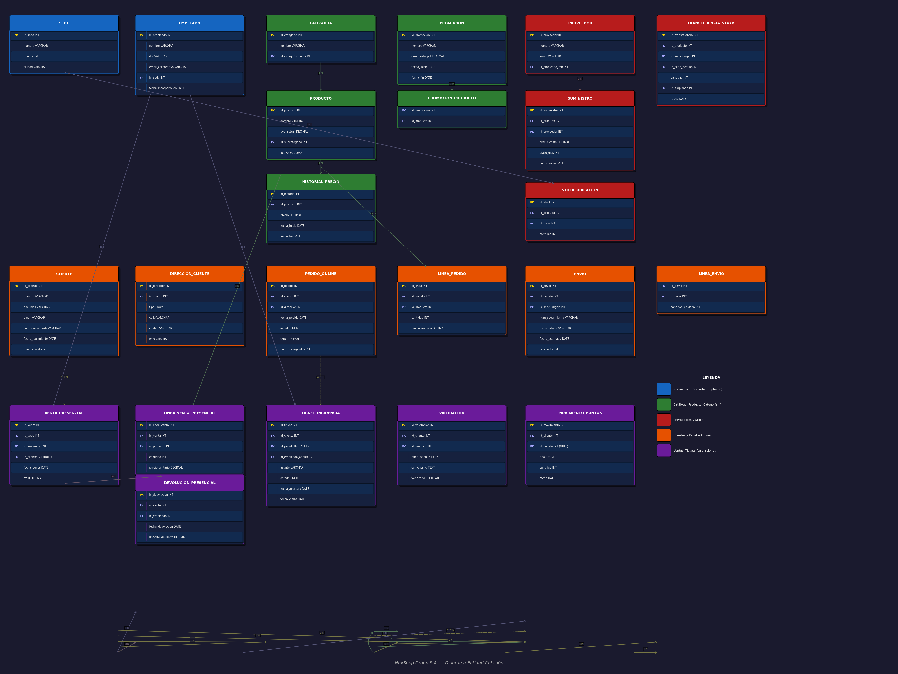

# NexShop Group S.A. — Base de Datos

**Alumno:** Juan Cortés  
**Módulo:** Bases de Datos — CodeArts  
**Nivel:** Intermedio-Avanzado

---

## Descripción del proyecto

Diseño e implementación completa de la base de datos para **NexShop Group S.A.**, empresa de distribución y venta al por menor con tienda online y tres tiendas físicas. El modelo cubre gestión de productos, clientes, pedidos online, ventas presenciales, logística, proveedores, fidelización y atención al cliente.

---

## Estructura del repositorio

```
mi-proyecto-nexshop/
├── README.md
├── docs/
│   ├── memoria.docx          ← Análisis de entidades, relaciones y preguntas de reflexión
│   ├── diagrama_er.png       ← Diagrama Entidad-Relación
│   └── modelo_relacional.pdf ← Modelo relacional con PKs, FKs y restricciones
├── sql/
│   ├── schema.sql            ← CREATE TABLE con restricciones
│   └── datos.sql             ← INSERT con datos de prueba realistas
└── consultas/
    └── consultas.sql         ← 14 consultas comentadas
```

---

## Cómo importar la base de datos

### Requisitos
- MySQL 8.x o superior (o XAMPP con MySQL)

### Pasos

```bash
# 1. Accede a MySQL
mysql -u root -p

# 2. Crea la base de datos
CREATE DATABASE nexshop;
USE nexshop;

# 3. Importa el esquema
SOURCE /ruta/a/sql/schema.sql;

# 4. Carga los datos de prueba
SOURCE /ruta/a/sql/datos.sql;

# 5. Ejecuta las consultas
SOURCE /ruta/a/consultas/consultas.sql;
```

---

## Diagrama ER



---

## Tecnologías usadas

- MySQL 8
- phpMyAdmin (XAMPP)
- draw.io (diagrama ER)
- Git / GitHub
